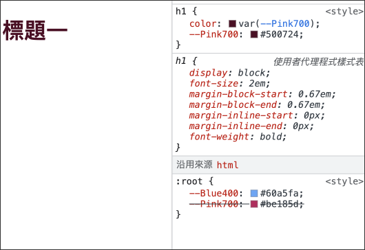
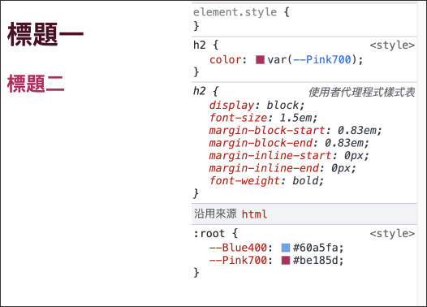

# CSS 全域變數

```css
:root {
  --Blue400: #60a5fa;
  --Pink700: #be185d;
}
```

```css
h1 {
    color: var(--Blue400);
}
```

```html
<h1>標題一</h1>
```


***
### 區域變數

只有該區域會影嚮，以`h1`為例，覆寫`--Pink700: #500724;`色碼，會影嚮到`h1`，其餘非`h1`又使用``--Pink700`不被影嚮

```css
h1 {
    color: var(--Pink700);
    --Pink700: #500724;
}
```
```html
<h2>標題一</h2>
```


###### `h2`不被區域變數影嚮，還是以全域變數為主。
